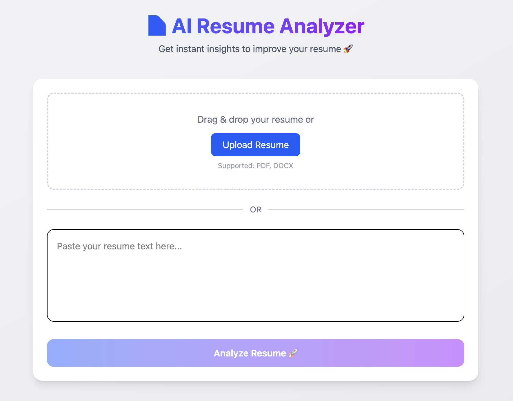

# 📄 AI Resume Analyzer & Optimizer

**AI-powered web app** that analyzes your resume and generates **actionable suggestions** (plus an optional **ATS-friendly rewrite**) to improve **clarity**, **impact**, and **structure**. It also supports an **Advanced Job Description Matcher** mode for role-specific insights.

<p>
  <a href="#-getting-started"></a>
  <a href="#-api"></a>
  <a href="#-tech-stack"></a>
  <a href="#-tech-stack"></a>
</p>



## 🌐 **Live Demo:** https://ai-resume-analyzer-indol-one.vercel.app/

## ✨ Features

- **🔍 Resume analysis**
  - Upload a resume (`.pdf`, `.docx`) **or** paste text
  - Returns **score (0–100)**, summary, strengths, weaknesses, suggestions
- **🎯 Job Description matcher (Advanced mode)**
  - Paste a target job description and match your resume against the role
  - Get more tailored feedback and ATS-style alignment insights
- **🛠️ “Fix My Resume” rewrite**
  - Rewrites your resume based on detected **weaknesses**
  - In advanced mode, optimizes suggestions/rewrite with job-role context
  - Outputs structured sections: **summary / experience / projects / skills**
- **🎯 Modern UI/UX**
  - Responsive layout (Tailwind)
  - Smooth loading states & conditional rendering

---

## 🧠 Tech stack

- **⚛️ Frontend**: React (Vite), Tailwind CSS
- **⚡ Backend**: FastAPI (Python)
- **🤖 AI**: OpenAI API
- **📎 Parsing**: PyPDF2 (PDF), python-docx (DOCX), python-multipart (uploads)

---

## ⚙️ How it works

1. **Upload** resume (or provide text input)
2. _(Optional)_ Enable **Advanced Analysis** and add a job description
3. Extract & clean content
4. AI analysis → **score + insights** (role-aware if JD is provided)
5. Optional rewrite → **“Fix My Resume”** (tailored in advanced mode)
6. Show results in the UI

---

## 🗂️ Project structure

```text
.
├─ src/                  # React app
├─ backend/              # FastAPI API
├─ package.json          # Frontend deps/scripts (Vite)
└─ backend/requirements.txt
```

---

## 🚀 Getting started

### ✅ Prerequisites

- **Node.js** (frontend)
- **Python 3.10+** (recommended) (backend)
- **OpenAI API key**

### 1) 📥 Clone

```bash
git clone https://github.com/<your-username>/ai-resume-analyzer.git
cd ai-resume-analyzer
```

### 2) 🧩 Backend setup (FastAPI)

```bash
cd backend
python -m venv .venv
source .venv/bin/activate
pip install -r requirements.txt
```

Create `backend/.env`:

```bash
OPENAI_API_KEY=your_api_key_here
```

Start the API:

```bash
uvicorn main:app --reload --port 8000
```

### 3) 🎨 Frontend setup (React + Vite)

In a new terminal:

```bash
cd ai-resume-analyzer
npm install
npm run dev
```

Open the app printed by Vite (usually **`http://localhost:5173`**).

---

## 🧪 API

✅ The frontend is currently configured to call:

- **`POST /analyze`**
- **`POST /rewrite`**

When running locally, that maps to:

- **`http://localhost:8000/analyze`**
- **`http://localhost:8000/rewrite`**

### 🔍 `POST /analyze`

Accepts `multipart/form-data` with **either**:

- **`file`**: PDF/DOCX resume file (used by the current UI flow)
- **`text`**: optional job description in **Advanced Analysis** mode

Returns:

```json
{
  "success": true,
  "data": {
    "score": 78,
    "summary": ["..."],
    "strengths": ["..."],
    "weaknesses": ["..."],
    "suggestions": ["..."]
  }
}
```

### ✨ `POST /rewrite`

Accepts `multipart/form-data` with:

- **`file`** **or** **`text`**
- **`weaknesses`**: JSON-encoded array of weaknesses (string)

In advanced mode, rewrite quality can be influenced by job-description context from the UI flow.

Returns:

```json
{
  "success": true,
  "data": {
    "summary": ["..."],
    "experience": ["..."],
    "projects": ["..."],
    "skills": ["..."],
    "changed": "..."
  }
}
```

---

## 🧯 Troubleshooting

- **❌ CORS / API not reachable**: ensure backend is running on **port `8000`**.
- **❌ 404 on `/*`**: the UI calls `/analyze` + `/rewrite`. If your backend exposes different paths, update backend routes or the `fetch()` URLs in `src/App.jsx`.
- **❌ Advanced Analysis not giving tailored results**: enable the checkbox and provide a non-empty job description before analyzing.

---

## 🗺️ Roadmap

- **📄 PDF export** of improved resume
- **🧩 Multiple templates**
- **🪞 Side-by-side comparison** (before vs after)
- **🌍 Production deploy** (Vercel + Render/Fly/etc.)

---

## 🤝 Contributing

Pull requests are welcome. Please open an issue for major changes.

---

## 📜 License

Add a license (MIT/Apache-2.0/etc.) if you plan to distribute this publicly.
